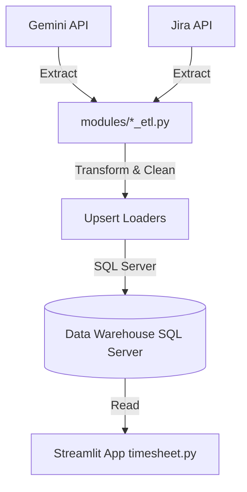

# Developer Documentation - NSS Timesheet App v26.5.6a

Αυτό το έγγραφο περιέχει τις τεχνικές λεπτομέρειες, την αρχιτεκτονική και την τεκμηρίωση των μεθόδων της εφαρμογής **NSS Timesheet Dashboard**. Είναι σχεδιασμένο για developers που θέλουν να συντηρήσουν, να επεκτείνουν ή να αποσφαλματώσουν την εφαρμογή.

---

## 1. Αρχιτεκτονική Εφαρμογής & Ροή Δεδομένων

Η εφαρμογή αποτελείται από τρία κύρια μέρη:
1. **Front-end / Interactive Dashboard (Streamlit)**: Υλοποιείται στο αρχείο [timesheet.py](timesheet.py). Παρέχει το γραφικό περιβάλλον χρήστη (GUI), τα φίλτρα, τα γραφήματα, τη διαχείριση χρηστών/ομάδων και τη Βάση Γνώσης (KB).
2. **Database (SQL Server)**: Αποθηκεύει όλα τα συγχρονισμένα δεδομένα (Projects, Users, Components, Issues, Worklogs, Comments, Audits), τις ρυθμίσεις των χρηστών, τα presets και τα logs της εφαρμογής.
3. **ETL Pipelines (Python Modules)**: Βρίσκονται στον φάκελο [modules/](modules/) και εκτελούν τις διαδικασίες Extract-Transform-Load από τα APIs του Gemini και του Jira προς τον SQL Server.

### Ροή Συγχρονισμού ETL


---

## 2. Ρύθμιση Περιβάλλοντος (Environment & Secrets)

Η εφαρμογή βασίζεται σε δύο αρχεία ρυθμίσεων:

### α. `.env` (Environment Variables)
Χρησιμοποιείται κυρίως από τα ETL modules για την αυθεντικοποίηση στα API.
* `GEMINI_URL`, `GEMINI_API_KEY`: Παράμετροι σύνδεσης στο Gemini API.
* `JIRA_URL`, `JIRA_EMAIL`, `JIRA_API_TOKEN`: Παράμετροι σύνδεσης στο Jira Cloud API.
* `GEMINI_TARGET_PROJECT_IDS`: Λίστα με Project IDs του Gemini (διαχωρισμένα με κόμμα) που θα συγχρονίζονται.

### β. `.streamlit/secrets.toml`
Χρησιμοποιείται από το Streamlit Dashboard.
* `CONNECTION_STRING`: SQL Server connection string (π.χ. `Server=...;Database=...;UID=...;PWD=...`).
* `COOKIE_SIGNATURE_KEY`: Μυστικό κλειδί (hash string) για την κρυπτογράφηση και υπογραφή των "Remember Me" cookies.

---

## 3. Σχήμα Βάσης Δεδομένων Data Warehouse (GeminiMetrics DB)

Το σχήμα του Data Warehouse (DWH) της βάσης **GeminiMetrics** αποτελείται από τους εξής πίνακες staging και καταγραφής ETL διεργασιών:

### α. Πίνακες Staging (Gemini & Jira)
* **`GProjects`**: Αποθηκεύει τα Projects από Gemini και Jira.
  * *Στήλες*: `ProjectID` (PK), `SourceApp` (PK - 'Gemini'/'Jira'), `ProjectCode`, `ProjectName`, `TemplateID`, `CreationDate`, `RowVersion`.
* **`GUsers`**: Συγκεντρωτικοί λογαριασμοί χρηστών.
  * *Στήλες*: `UserID` (PK - string για υποστήριξη Jira accountId), `SourceApp` (PK), `Username`, `Firstname`, `Surname`, `Fullname`, `Email`, `APIKey`, `Active`, `CreationDate`, `RowVersion`.
* **`GIssues`**: Όλα τα tickets/issues των συστημάτων.
  * *Στήλες*: `IssueID` (PK), `SourceApp` (PK), `IssueKey`, `ProjectID`, `VersionID`, `Reporter`, `Title`, `Type`, `Priority`, `Severity`, `Resolution`, `Status`, `CreationDate`, `RevisedDate`, `ClosedDate`, `AffectedVersions`, `Resources`, `Components`, `ImportedAt`, `RowVersion`.
* **`GComponents`**: Components των projects.
  * *Στήλες*: `ComponentID` (PK), `SourceApp` (PK), `ProjectID`, `ComponentName`, `ComponentDesc`, `ParentID`, `CreationDate`, `RowVersion`.
* **`GComments`**: Σχόλια των Issues.
  * *Στήλες*: `ID` (PK, auto), `CommentID`, `SourceApp`, `IssueID`, `ProjectID`, `UserID`, `Fullname`, `Comment`, `Created`.
* **`GAudit`**: Ιστορικό αλλαγών (Audit trail) των issues.
  * *Στήλες*: `ID` (PK, auto), `AuditID`, `SourceApp`, `IssueID`, `ProjectID`, `UserID`, `Fullname`, `Created`, `FieldName`, `OldValue`, `NewValue`.
* **`GIssueCustomFields`**: Τιμές Custom Fields των issues.
  * *Στήλες*: `IssueID` (PK), `CustomFieldID` (PK), `SourceApp` (PK), `CustomFieldName`, `ProjectID`, `FieldValue`.
* **`GTimeTracking`**: Καταγραφές χρόνων (Gemini Time Trackings).
  * *Στήλες*: `TimeEntryID` (PK), `SourceApp` (PK), `IssueID`, `ProjectID`, `TimeEntryDate`, `TimeCreationDate`, `TimeResourceID`, `TimeHours`, `TimeMinutes`, `TimeComment`, `TimeTypeID`, `TimeTypeName`, `IssueComponent`.

### β. Πίνακες Μεταδεδομένων & Logs ETL
* **`ETL_Queue`**: Ουρά διεργασιών ETL για ασύγχρονη (asynchronous) εκτέλεση στο παρασκήνιο.
  * *Στήλες*: `JobID` (PK - IDENTITY), `JobType` (VARCHAR(50)), `IssueKey` (VARCHAR(50), NULL), `StartDate` (VARCHAR(50), NULL), `EndDate` (VARCHAR(50), NULL), `DateFilterType` (VARCHAR(20), NULL), `Status` (VARCHAR(20) - 'Pending'/'Running'/'Success'/'Failed'), `CreatedBy` (VARCHAR(100)), `CreatedAt` (DATETIME, default GETDATE()), `StartedAt` (DATETIME, NULL), `FinishedAt` (DATETIME, NULL), `LogFilePath` (NVARCHAR(255), NULL).
* **`SyncMetadata`**: Καταγράφει την ημερομηνία τελευταίας εκτέλεσης του ETL ανά οντότητα.
  * *Στήλες*: `Id` (PK), `EntityName`, `LastSyncAt`.
* **`SyncLog`**: Header logs εκτέλεσης του ETL pipeline.
  * *Στήλες*: `ID` (PK), `EntityName`, `StartedAt`, `FinishedAt`, `Inserted`, `Updated`, `Failed`, `Total`, `Status`, `LogFilePath`, `RowVersion`.
* **`SyncLogDetails`**: Αναλυτικά logs σφαλμάτων/βημάτων για κάθε header log.
  * *Στήλες*: `ID` (PK), `SyncLogID` (FK -> `SyncLog.ID`), `RecordID`, `ErrorMessage`, `Message`, `StackTrace`, `LogType`, `OccuredAt`, `RowVersion`.

---

## 4. Μέθοδοι & Συναρτήσεις στο [timesheet.py](timesheet.py)

### 4.1. Βοηθητικές Συναρτήσεις UI & Φιλτραρίσματος
* **`on_only_me_click(username)`**: Callback που θέτει το φίλτρο Assignee αποκλειστικά στον τρέχοντα χρήστη.
* **`clear_keys_and_rerun(keys_to_clear)`**: Διαγράφει συγκεκριμένα κλειδιά από το session state και το backup λεξικό και κάνει rerun.
* **`is_content_visible(target_apps_str)`**: Επιστρέφει `True` αν το περιεχόμενο πρέπει να εμφανιστεί με βάση τις επιλεγμένες εφαρμογές στο sidebar.
* **`format_to_hhmm(minutes)`**: Μετατρέπει τα λεπτά σε μορφή `HH:MM`.
* **`get_business_days(start_ts, end_ts)`**: Υπολογίζει τις εργάσιμες ημέρες σε 8ωρο SLA (Δευτέρα - Παρασκευή 9πμ - 5μμ), εξαιρώντας τα Σαββατοκύριακα (οι ελληνικές αργίες μετρούν κανονικά ως εργάσιμες ημέρες λόγω προσωπικού ασφαλείας).

### 4.2. Σύνδεση Βάσης & Auto-Migrations
* **`get_db_engine()`**: Επιστρέφει το SQLAlchemy Engine για τη σύνδεση στον SQL Server. Επιπλέον, εκτελεί αυτόματα (Self-Healing) ελέγχους και migrations αν λείπουν οι στήλες:
  * `User_Presets.IsDefault`
  * `ContentHub.TargetApps`
  * `KBArticles.TargetApps`
  * `Users.AppPreferences`

### 4.3. Διαχείριση Χρηστών & Sessions
* **`hash_password(password)`**: Δημιουργεί SHA256 Hash ενός κωδικού.
* **`verify_user_credentials(username, password)`**: Ελέγχει τα στοιχεία εισόδου στη βάση.
* **`create_user_session(user_id)`**: Δημιουργεί και αποθηκεύει ένα session token στη βάση.
* **`verify_user_session(session_token)`**: Επαληθεύει ένα ενεργό session token.
* **`delete_user_session(session_token)`**: Διαγράφει το session κατά το logout.
* **`delete_all_user_sessions(user_id)`**: Ακυρώνει όλα τα ενεργά sessions ενός χρήστη.
* **`register_new_user(username, password, email, role, display_name)`**: Εισάγει νέο χρήστη στη βάση.
* **`load_all_users_admin()`**: Επιστρέφει όλους τους χρήστες (για το panel διαχείρισης).
* **`admin_update_user_status(user_id, is_active)`**: Ενεργοποιεί/Απενεργοποιεί έναν λογαριασμό.
* **`admin_reset_user_password(user_id, default_pwd)`**: Επαναφέρει τον κωδικό χρήστη στον default.

### 4.4. Διαχείριση Presets (Saved Previews)
* **`load_user_presets(user_id)`**: Φορτώνει τα presets ενός χρήστη.
* **`save_user_preset(user_id, name, filters_json)`**: Αποθηκεύει ένα νέο preset.
* **`update_user_preset(user_id, name, filters_json)`**: Ενημερώνει ένα υπάρχον preset.
* **`get_user_default_preset(user_id, type_keyword)`**: Επιστρέφει το προεπιλεγμένο preset.
* **`set_preset_as_default(user_id, name, type_keyword)`**: Ορίζει ένα preset ως προεπιλογή.
* **`apply_preset_filters(filters_json)`**: Εφαρμόζει τα αποθηκευμένα φίλτρα στο session state.

### 4.5. Ασφάλεια & Cookies ("Remember Me")
* **`get_cookie_signature(session_token)`**: Δημιουργεί HMAC υπογραφή για το cookie.
* **`set_cookie(name, value, ttl_days, trigger_reload)`**: Αποθηκεύει ένα ασφαλές cookie στον browser.
* **`erase_cookie(name, trigger_reload)`**: Διαγράφει ένα cookie από τον browser.

### 4.6. Διαχείριση Ομάδων (Teams)
* **`load_groups_from_db()`**: Φορτώνει τις διαθέσιμες ομάδες.
* **`load_group_members(group_id)`**: Επιστρέφει τα μέλη μιας ομάδας.
* **`create_new_group_with_members(name, member_ids)`**: Δημιουργεί μια ομάδα.
* **`update_group_with_members(group_id, name, member_ids)`**: Ενημερώνει τα μέλη/όνομα μιας ομάδας.
* **`delete_group(group_id)`**: Διαγράφει μια ομάδα.

### 4.7. Content Hub & Knowledge Base Helpers
* **`load_latest_content(content_type)`**: Φορτώνει την πιο πρόσφατη ανακοίνωση/pro tip, κάνοντας `LEFT JOIN` με τους χρήστες για να εμφανίσει τον συντάκτη.
* **`load_all_content_admin()`**: Επιστρέφει όλο το περιεχόμενο του ContentHub.
* **`save_content_item(...)` / `update_content_item(...)` / `delete_content_item(...)`**: Διαχείριση CRUD των ανακοινώσεων και pro tips.
* **`load_kb_articles(only_active)`**: Φορτώνει τα άρθρα της βάσης γνώσης με το όνομα του συντάκτη.
* **`save_kb_article(...)` / `update_kb_article(...)` / `delete_kb_article(...)`**: Διαχείριση CRUD των άρθρων KB.

### 4.8. Rendering Σελίδων Dashboard
* **`render_dashboard_content(df, last_updated)`**: Σχεδιάζει την κεντρική σελίδα Timesheet (γραφικά, πίνακες, presets, φίλτρα).
* **`open_article_modal(title, content, author)`**: Dialog παράθυρο ανάγνωσης άρθρου KB.
* **`render_knowledge_base_content()`**: Σελίδα της Βάσης Γνώσης και αναζήτησης/διαχείρισης άρθρων.
* **`render_announcements_and_tips()`**: Σελίδα προβολής και διαχείρισης ανακοινώσεων/pro tips.
* **`render_profile_content()`**: Σελίδα ρυθμίσεων προφίλ χρήστη.
* **`render_management_content()`**: Διαχειριστικό panel χρηστών και ομάδων.
* **`render_response_times_content()`**: Dashboard χρόνων απόκρισης (KPIs / SLAs).
* **`render_etl_manager_content()`**: Σελίδα ελέγχου και εκτέλεσης των ETL διεργασιών.
* **`render_manual_content()`**: Σελίδα του Οδηγού Χρήσης (Manual).

### 4.9. Φόρτωση & Υπολογισμός Χρόνων Απόκρισης (KPIs / SLA)
* **`rt_load_from_db()`**: Αντλεί τα βασικά δεδομένα των Epic tickets από τον SQL Server.
* **`rt_load_first_response()`**: Φορτώνει τις ημερομηνίες της πρώτης εσωτερικής και εξωτερικής απάντησης για κάθε ticket.
* **`rt_load_first_assigned()`**: Αντλεί την πρώτη ημερομηνία ανάθεσης (assigned) για κάθε ticket.
* **`rt_load_status_change_date()`**: Αντλεί την πρώτη ημερομηνία της πρώτης μετάβασης σε κατάσταση "In Progress" από τον πίνακα `GAudit` για κάθε ticket.
* **`rt_load_awaiting_customer_end_date()`**: Αντλεί τις περιόδους κατά τις οποίες το ticket βρισκόταν σε κατάσταση "AWAITING CUSTOMER" από τον πίνακα `GAudit` για τον υπολογισμό των χρόνων αναμονής.

#### α. Λογική Υπολογισμού SLA 8ώρου (`get_business_days`)
Η συνάρτηση `get_business_days(start_ts, end_ts)` υπολογίζει τον χρόνο που μεσολαβεί μεταξύ δύο ημερομηνιών σε ημέρες εργάσιμου SLA:
* **Ωράριο SLA**: Δευτέρα έως Παρασκευή, 09:00 - 17:00 (8 ώρες/ημέρα).
* **Σαββατοκύριακα**: Εξαιρούνται αυτόματα.
* **Επίσημες Αργίες**: Συμπεριλαμβάνονται κανονικά στον υπολογισμό, καθώς υπάρχει προσωπικό ασφαλείας.
* **Μέθοδος Υπολογισμού**: Δημιουργεί ένα εύρος ημερών (`pd.date_range`) και για κάθε ημέρα ελέγχει αν είναι εργάσιμη (Δευτ-Παρ). Υπολογίζει τα δευτερόλεπτα επικάλυψης του ticket με το διάστημα 09:00-17:00 της συγκεκριμένης ημέρας. Το σύνολο των δευτερολέπτων διαιρείται με το 8ωρο (28.800 δευτερόλεπτα) για να μετατραπεί σε SLA ημέρες.

#### β. Μετρήσεις In Progress & Awaiting Customer
* **`Creation -> InProgress`**: Ο χρόνος από τη δημιουργία του αιτήματος μέχρι την πρώτη μετάβαση σε "In Progress" (ένδειξη χρόνου ανταπόκρισης).
* **`InProgress -> Closed`**: Ο καθαρός χρόνος επεξεργασίας από την έναρξη των εργασιών μέχρι το κλείσιμο του αιτήματος.
* **`Total Awaiting`**: Ο συνολικός χρόνος που πέρασε το αίτημα σε κατάσταση "Awaiting Customer" (αναμονή από πελάτη), υπολογισμένος σε εργάσιμες ημέρες.
* **`Net Creation -> Closed`**: Ο καθαρός κύκλος κλεισίματος, δηλαδή ο συνολικός χρόνος `Creation -> Closed` μείον τον χρόνο `Total Awaiting`. Ο συγκεκριμένος δείκτης λειτουργεί ορθά μόνο για τελικά statuses αιτημάτων (Closed).

#### γ. Διπλός Υπολογισμός Εισιτηρίων (Filtered vs Total)
Στις κάρτες KPI Summary και στη dynamic ομαδοποίηση (Group By) γίνεται διαχωρισμός του όγκου:
* **Filtered Tickets**: Το πλήθος των Epic tickets που ικανοποιούν όλα τα ενεργά φίλτρα (Assignee, Customer, Partner, Component, κ.λπ.).
* **Total Tickets**: Το σύνολο των Epic tickets της επιλεγμένης περιόδου, το οποίο επηρεάζεται **μόνο** από τα ημερομηνιακά φίλτρα (Creation & Closed Date range), λειτουργώντας ως σταθερή βάση σύγκρισης για την απόδοση της ομάδας.

---

## 5. Μέθοδοι στα ETL Modules (Φάκελος `/modules`)

### 5.1. [modules/test_projects_etl.py](modules/test_projects_etl.py)
* **`run_real_projects_etl()`**: Αντλεί όλα τα projects από το Gemini API και τα αποθηκεύει στον πίνακα `GProjects`.
* **`run_jira_projects_etl()`**: Αντλεί όλα τα projects από το Jira API. Φιλτράρει μόνο τα projects με κλειδιά: `PYLCOM`, `PYLFLE`, `PLINTS`, `PYFLDR`, `ESLKAS`, `GLXENT`. Τα αποθηκεύει στον `GProjects` με `SourceApp = 'Jira'`.

### 5.2. [modules/test_users_etl.py](modules/test_users_etl.py)
* **`run_users_etl()`**: Συγχρονίζει όλους τους ενεργούς χρήστες από το Gemini API στον πίνακα `GUsers`.
* **`run_jira_users_etl()`**: Συγχρονίζει τους χρήστες από το Jira Cloud API στον πίνακα `GUsers`.

### 5.3. [modules/test_components_etl.py](modules/test_components_etl.py)
* **`run_components_etl()`**: Συγχρονίζει τα components των projects από το Gemini.
* **`run_jira_components_etl()`**: Συγχρονίζει τα components των Jira projects.

### 5.4. [modules/test_issues_etl.py](modules/test_issues_etl.py)
* **`run_incremental_issues_and_children_etl()`**: Εκτελεί incremental συγχρονισμό για τα Gemini Issues, Comments, Audits (History), Custom Fields και Time Trackings. Ελέγχει την ημερομηνία `last_sync` και φέρνει μόνο τα τροποποιημένα/νέα στοιχεία.
* **`run_incremental_jira_etl(ignore_last_sync=False)`**: Εκτελεί incremental συγχρονισμό για τα Jira Issues.
  * **`ignore_last_sync=True` (Jira Full Sync)**: Παρακάμπτει την ημερομηνία τελευταίου συγχρονισμού και θέτει ως αρχική ημερομηνία την `2000-01-01`, κάνοντας λήψη όλων των δεδομένων από το μηδέν.
  * Φιλτράρει τα issues βάσει των Jira Projects και του JQL query: `(product name[dropdown] IN ("PYLON COMMERCIAL", "PYLON ERP", "PYLON FLEX", "Galaxy Enterprise") OR product name[dropdown] IS EMPTY)`.
* **`run_single_jira_issue_sync(issue_key)`**: Συγχρονίζει ένα συγκεκριμένο Jira Issue με βάση το IssueKey (π.χ. `PYLCOM-1259`). Εκτελεί όλα τα επιμέρους βήματα (σύνδεση, λήψη raw δεδομένων, transform για Issues, Audits, Custom Fields, Comments, Worklogs και upsert loaders στη βάση δεδομένων) με αναλυτικό step-by-step logging για σκοπούς debugging. Εξασφαλίζει επίσης την κωδικοποίηση της κονσόλας σε UTF-8 για την αποφυγή encoding σφαλμάτων σε Windows locale.
* **`run_jira_date_range_sync(start_date_str, end_date_str, date_type='updated')`**: Συγχρονίζει τα Jira Issues που δημιουργήθηκαν ή ενημερώθηκαν σε ένα συγκεκριμένο ημερομηνιακό διάστημα. Κατασκευάζει JQL ερώτημα φιλτράροντας με βάση το πεδίο `updated` ή `created` του Jira.

### 5.5. [modules/test_comments_etl.py](modules/test_comments_etl.py)
* **`run_incremental_comments_etl()`**: Εκτελεί μεμονωμένο incremental συγχρονισμό για τα σχόλια (Comments) των Issues.

### 5.6. [etl_worker.py](etl_worker.py)
* **Background Worker**: Ένας αυτόνομος daemon που εκτελείται συνεχώς (polling loop ανά 3 δευτερόλεπτα) στον server. 
  * Αντλεί το παλαιότερο job με κατάσταση `Pending` από τον πίνακα `ETL_Queue`.
  * Εξασφαλίζει ότι εκτελείται μόνο ένα job τη φορά για την αποφυγή locks στη βάση.
  * Εκκινεί ένα ξεχωριστό subprocess (Python με unbuffered flag `-u` και εξαναγκασμένο `PYTHONIOENCODING=utf-8`) για την απομόνωση της εκτέλεσης.
  * Κατευθύνει τα live logs της διεργασίας σε αρχείο log στη διαδρομή `logs/etl_job_<JobID>.log`.
  * Ενημερώνει την κατάσταση του job σε `Running`, `Success` ή `Failed` ανάλογα με το exit code του subprocess.
  * **Self-Healing (Αυτο-ίαση)**: Κατά την εκκίνησή του, ο worker εντοπίζει αυτόματα τυχόν εργασίες που είχαν μείνει σε κατάσταση `Running` (λόγω προηγούμενης βίαιης διακοπής ή κρασαρίσματος του συστήματος) και τις θέτει αυτόματα σε κατάσταση `Failed` (Interrupted), απελευθερώνοντας άμεσα την ουρά.

### 5.7. Μηχανισμός Αποφυγής & Διαχείρισης Deadlocks (Database Deadlock Handling)
Για την αποφυγή συγκρούσεων (deadlocks) κατά την παράλληλη εκτέλεση του Streamlit Dashboard και του ETL Background Worker, εφαρμόζονται οι εξής τεχνικές στο [src/etl/loaders.py](src/etl/loaders.py):
* **Δυναμική Ονοματολογία Staging Πινάκων (Dynamic Staging Tables)**: Αντί για στατικά ονόματα (π.χ. `GComments_StagingTemp`), οι προσωρινοί staging πίνακες παράγονται πλέον δυναμικά με μοναδικό τυχαίο suffix (π.χ. `GComments_Stg_<random_uuid_suffix>`). Αυτό εξαλείφει πλήρως τις συγκρούσεις κλειδωμάτων και τις αλληλοεπικαλύψεις μεταξύ διαφορετικών ETL jobs.
* **Μηχανισμός Αυτόματης Επανάληψης (Retry Decorator on Deadlock)**: Όλες οι loaders συναρτήσεις (`upsert_issues`, `upsert_comments`, κλπ.) είναι διακοσμημένες με τον decorator `@retry_on_deadlock()`. Σε περίπτωση που ο SQL Server επιλέξει τη συναλλαγή ως θύμα deadlock (Error Code `1205`, SQLState `40001`), ο decorator εκτελεί αυτόματα rollback, περιμένει ένα μικρό διάστημα με τυχαία καθυστέρηση (exponential backoff with jitter) και επαναλαμβάνει τη συναλλαγή (έως 5 προσπάθειες) χωρίς να κρασάρει η διεργασία.

---

## 6. Διαδικασία Συντήρησης & Rerun

1. **Προσθήκη νέου Custom Field (Jira)**: 
   Για να προστεθεί ένα νέο custom field στο συγχρονισμό του Jira, απλά προσθέστε το όνομα και το ID του στο αρχείο [jira_custom_fields.csv](jira_custom_fields.csv). Το ETL θα το διαβάσει αυτόματα στην επόμενη εκτέλεση.
2. **Rerun από το μηδέν (Jira)**:
   Αν για οποιοδήποτε λόγο χαθούν δεδομένα ή χρειαστεί πλήρης επανασυγχρονισμός, χρησιμοποιήστε το tab **Jira Full Sync (Από Μηδέν)** στον ETL Manager της εφαρμογής.
3. **Αποσφαλμάτωση Μεμονωμένου Εισιτηρίου (Jira Debugger)**:
   Αν κάποιο συγκεκριμένο Jira Issue εμφανίζει κενά δεδομένα ή σφάλματα συγχρονισμού, μεταβείτε στο tab **🔍 ETL Debugger** στον ETL Manager. Εισάγετε το Issue Key (π.χ. `PYLCOM-1259`) και πατήστε το κουμπί συγχρονισμού. Το ETL θα εκτελέσει απομονωμένα όλα τα βήματα λήψης, μετασχηματισμού και αποθήκευσης, εμφανίζοντας live-streaming logs και stack traces σφαλμάτων στην οθόνη.
4. **Εκτέλεση του Background Worker**:
   Ο background worker πρέπει να τρέχει συνεχώς στον server για να επεξεργάζεται την ουρά. 
   - **Χειροκίνητη εκκίνηση**: Από το root directory της εφαρμογής, εκτελέστε:
     ```powershell
     python etl_worker.py
     ```
   - **Ρύθμιση ως Windows Service**: Για παραγωγική λειτουργία (production), προτείνεται η εγκατάσταση του `etl_worker.py` ως Windows Service χρησιμοποιώντας το εργαλείο **NSSM (Non-Sucking Service Manager)**:
     ```powershell
     nssm install NSSTimesheetWorker "C:\Users\d.batsilis\AppData\Local\Programs\Python\Python314\python.exe" "C:\Users\d.batsilis\OneDrive - Epsilon Net S.A\Development\NSSTimesheetApp\etl_worker.py"
     nssm set NSSTimesheetWorker AppDirectory "C:\Users\d.batsilis\OneDrive - Epsilon Net S.A\Development\NSSTimesheetApp"
     nssm start NSSTimesheetWorker
     ```
5. **📅 Συγχρονισμός με Ημερομηνιακό Εύρος**:
   Αν παρατηρηθεί απώλεια δεδομένων για συγκεκριμένο χρονικό διάστημα (π.χ. λόγω διακοπής ρεύματος ή δικτύου), μπορείτε να χρησιμοποιήσετε το tab **📅 Date Range Sync** στον ETL Manager. Επιλέξτε το διάστημα και τον τύπο ημερομηνίας (Updated/Created) για να αναγκάσετε το ETL να τραβήξει και να κάνει upsert όλα τα σχετικά issues.

